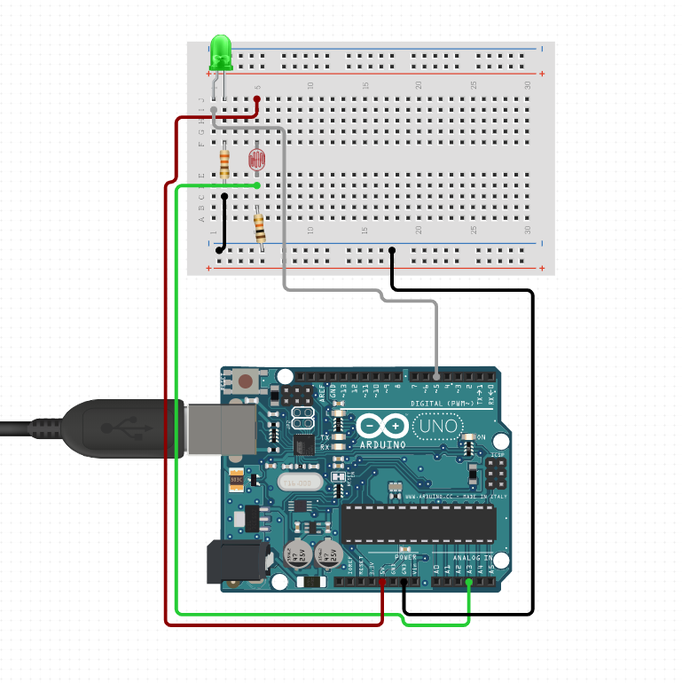

# ICVLC Receiver

> Inter-Car Visible Light Communication (Receiver)

부호화된 데이터를 조도 센서를 통해 해석하여 시리얼 포트로 출력하는 아두이노 프로그램

## 회로 구성

## 사용법

### TimerOne 라이브러리 추가하기

1. 아두이노 IDE의 메뉴에서 **스케치 &rarr; 라이브러리 포함하기 &rarr; .ZIP 라이브러리 추가**를 선택한다.
2. 리포지토리에 포함된 `TimerOne-master.zip` 파일을 선택하여 TimerOne 라이브러리를 추가한다.

## License

[MIT](https://github.com/icvlc/receiver/blob/master/LICENSE)
